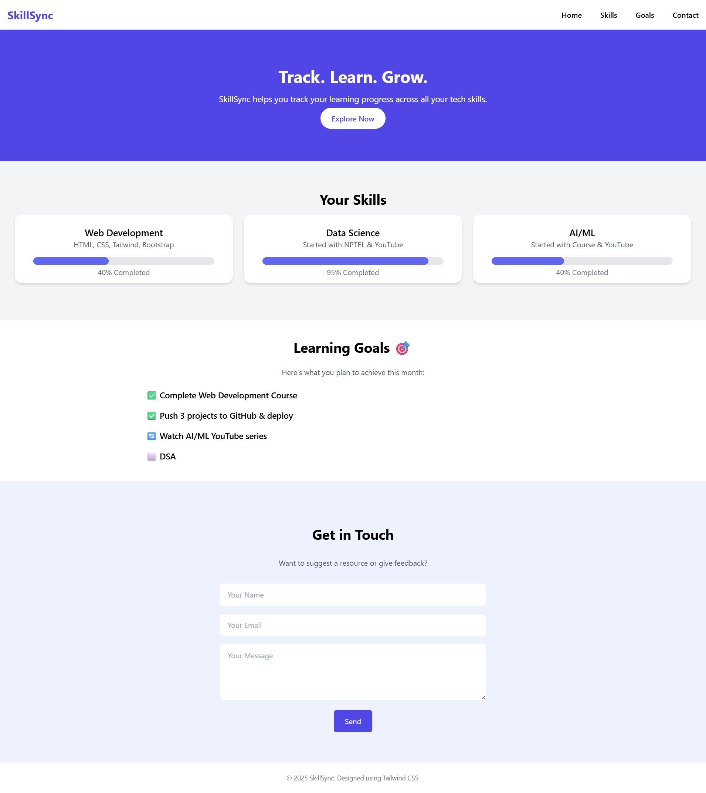

# 🚀 SkillSync – Personal Skill Tracker Website

**SkillSync** is a modern, minimal, and responsive web application built using **Tailwind CSS**.  
It’s designed to help learners track their progress across various technical skills, set goals, and stay motivated throughout their learning journey.

---

## ✨ Features

- 🔥 Hero Section with Catchy CTA
- 📊 Skill Cards with Visual Progress Bars
- 🎯 Monthly Goal Checklist (✅, 🔄, ⬜)
- 📩 Contact Form with Beautiful UI
- 💻 Fully Responsive Design using Tailwind CSS
- 📱 Mobile-friendly layout

---

## 🛠️ Tech Stack

- **HTML5**
- **Tailwind CSS v2.2.19**

---

## 📸 Screenshots

> 

---

## 🌐 Live Demo

[🔗 View Live on GitHub Pages](https://your-username.github.io/SkillSync)

---

## 📁 Project Structure

SkillSync/
├── index.html # Main HTML file
├── output.css # Tailwind CSS file
└── README.md # You're reading it!

---

## 📌 How I Built It

This project was built as part of my journey to master **Tailwind CSS**.  
It reflects real personal goals, learning stages, and an understanding of layout design using utility-first CSS.

---

## 📣 Feedback

Have suggestions, feedback, or resources to share?  
Feel free to [open an issue](https://github.com/your-username/SkillSync/issues) or submit a pull request.

---

## 🙌 Acknowledgements

Inspired by the idea of building something practical while learning Tailwind CSS.  
Thanks to all the open-source resources and creators online.

---

## 📍 Author

**Raja Shreenivas Reddy**  
📬 [Connect on LinkedIn](https://www.linkedin.com/in/raja-shreenivas-reddy-472265304?lipi=urn%3Ali%3Apage%3Ad_flagship3_profile_view_base_contact_details%3BB18deLASRsSm%2BJmyg2N35w%3D%3D)  
🐱 [GitHub Profile](https://github.com/RAJASHREENIVASREDDY)

---

> Made with ❤️ using Tailwind CSS.
